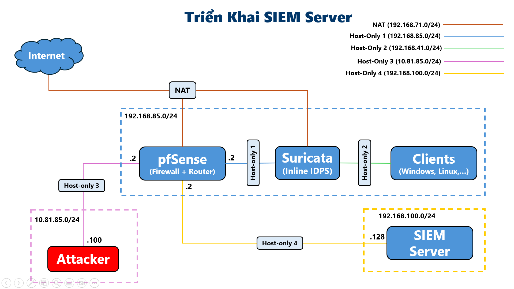

# Research and Implementation of a Centralized Management and Processing System for Cyber Attack Events 

**Dự án này vẫn đang được tiến hành, nội dung bên dưới chỉ là bản tóm tắt về dự án, không phải là phiên bản chính thức.**

# **Mô Tả**
Triển khai một giải pháp Security Information and Event Management (SIEM) sử dụng Elastic Stack (ELK) để thu thập, xử lý, phân tích và trực quan hóa các sự kiện an ninh mạng trong một môi trường mô phỏng. Dự án tập trung vào việc giám sát log từ các hệ thống Windows, Linux và các thiết bị an ninh như Suricata và pfSense để phát hiện, điều tra và phản ứng với các mối đe dọa.

# **Công Nghệ Sử Dụng**
*   **Elastic Stack (ELK):** Bao gồm Elasticsearch (lưu trữ, tìm kiếm, phân tích phân tán), Logstash (thu thập, xử lý dữ liệu pipeline), Kibana (trực quan hóa, phân tích, giao diện SIEM) và Beats (Elastic Agent/Filebeat) (thu thập dữ liệu nhẹ).
*   **Network/Security Devices:** pfSense (router, firewall, log forwarding), Suricata (Inline IDS/IPS, rule-based detection).
*   **Log Sources:** Windows Event Logs (Security, System, Application), Linux System Logs (syslog, auth.log, kern.log), Web Server Logs (Nginx access/error logs).
*   **Other Tools:** Nginx (reverse proxy), Metasploitable2 (môi trường thử nghiệm tấn công).
*   **Query Languages:** Elasticsearch Query DSL, Kibana Query Language (KQL).
*   **Frameworks:** MITRE ATT&CK Framework (mapping detection rules).

# **Nhiệm Vụ**
*   Thiết kế và triển khai kiến trúc tổng quan của hệ thống SIEM dựa trên Elastic Stack, bao gồm việc triển khai các thành phần chính (Elasticsearch, Logstash, Kibana) và các agent thu thập dữ liệu (Filebeat, Elastic Agent).
*   Cấu hình các nguồn dữ liệu (Windows, Linux, Suricata, pfSense) để thu thập và gửi log về SIEM bằng Filebeat.
*   Thiết lập pfSense làm router và firewall trung tâm, cấu hình rule định tuyến, NAT và chuyển tiếp log hệ thống.
*   Triển khai Suricata ở chế độ Inline IDS/IPS để giám sát và phát hiện các hành vi xâm nhập dựa trên rule signature.
*   Phát triển và tinh chỉnh các rule custom cho Suricata để kiểm thử khả năng phát hiện các kiểu tấn công cụ thể.
*   Xây dựng các pipeline Logstash để nhận, parse, chuẩn hóa (sử dụng grok, mutate, json, prune filters) và làm sạch dữ liệu từ các nguồn khác nhau (Suricata eve.json, Nginx logs, system logs, Windows Security logs) trước khi lưu trữ vào Elasticsearch.
*   Cấu hình Nginx làm reverse proxy để quản lý truy cập và bảo mật (HTTPS) cho các thành phần SIEM (Filebeat/Logstash input, Kibana UI).
*   Quản lý lưu trữ dữ liệu trong Elasticsearch, bao gồm hiểu biết về index, document, mapping, sharding và replication để đảm bảo hiệu suất và tính sẵn sàng.
*   Sử dụng Kibana để tạo Index Patterns, xây dựng Visualizations (biểu đồ, bảng) và Dashboards để trực quan hóa và giám sát dữ liệu an ninh theo thời gian thực.
*   Thực hiện các truy vấn dữ liệu trong Kibana bằng Kibana Query Language (KQL) và Elasticsearch Query DSL để phân tích sâu hơn.
*   Xây dựng và triển khai Detection Rules trong Kibana SIEM để tự động phát hiện các hành vi bất thường và tấn công (ví dụ: ICMP/UDP Flood, SSH Brute Force, Command Injection), đồng thời mapping các rule này với MITRE ATT&CK Framework.
*   Tiến hành giả lập các cuộc tấn công cơ bản (ICMP Flood, UDP Flood, C2 qua HTTPS/TLS) để kiểm thử khả năng phát hiện của Suricata và SIEM.
*   Nghiên cứu và hiểu rõ cấu trúc cũng như các loại log quan trọng trên hệ điều hành Windows (.evtx) và Linux (/var/log/*) để hỗ trợ quá trình thu thập và phân tích.
*   Áp dụng các nguyên tắc bảo mật cơ bản trong Elastic Stack (xác thực, ủy quyền RBAC, mã hóa SSL/TLS) để bảo vệ dữ liệu và hệ thống.

---

**This project is still in progress, the content below is just an overview of the project, not the official version**

# **Description**
Deployed a Security Information and Event Management (SIEM) solution leveraging the Elastic Stack (ELK) to collect, process, analyze, and visualize cybersecurity events within a simulated environment. The project focused on monitoring logs from Windows and Linux systems, along with security devices like Suricata and pfSense, to detect, investigate, and respond to threats.

# **Technologies**
*   **Elastic Stack (ELK):** Comprising Elasticsearch (distributed search and analytics), Logstash (data processing pipeline), Kibana (visualization, analysis, SIEM interface), and Beats (Elastic Agent/Filebeat) (lightweight data shippers).
*   **Network/Security Devices:** pfSense (router, firewall, log forwarding), Suricata (Inline IDS/IPS, rule-based detection).
*   **Log Sources:** Windows Event Logs (Security, System, Application), Linux System Logs (syslog, auth.log, kern.log), Web Server Logs (Nginx access/error logs).
*   **Other Tools:** Nginx (reverse proxy), Metasploitable2 (attack simulation environment).
*   **Query Languages:** Elasticsearch Query DSL, Kibana Query Language (KQL).
*   **Frameworks:** MITRE ATT&CK Framework (mapping detection rules).

# **Responsibilities**
*   Designed and implemented the overall architecture of the Elastic Stack-based SIEM system, including deploying core components (Elasticsearch, Logstash, Kibana) and data collection agents (Filebeat, Elastic Agent).
*   Configured various data sources (Windows, Linux, Suricata, pfSense) to collect and send logs to the SIEM using Filebeat.
*   Set up pfSense as the central router and firewall, configuring routing rules, NAT, and forwarding system logs.
*   Deployed Suricata in Inline IDS/IPS mode to monitor and detect intrusion behaviors based on signature rules.
*   Developed and refined custom Suricata rules to test the detection capabilities against specific attack types.
*   Built Logstash pipelines to receive, parse, standardize (using grok, mutate, json, prune filters), and clean data from diverse sources (Suricata eve.json, Nginx logs, system logs, Windows Security logs) before storing it in Elasticsearch.
*   Configured Nginx as a reverse proxy to manage access and provide security (HTTPS) for SIEM components (Filebeat/Logstash input, Kibana UI).
*   Managed data storage in Elasticsearch, including understanding Index, Document, Mapping, Sharding, and Replication for performance and availability.
*   Utilized Kibana to create Index Patterns, build Visualizations (charts, tables), and Dashboards to visualize and monitor security data in real-time.
*   Performed data querying in Kibana using Kibana Query Language (KQL) and Elasticsearch Query DSL for in-depth analysis.
*   Developed and implemented Detection Rules within Kibana SIEM to automatically detect suspicious behaviors and attacks (e.g., ICMP/UDP Flood, SSH Brute Force, Command Injection), mapping these rules to the MITRE ATT&CK Framework.
*   Conducted basic attack simulations (ICMP Flood, UDP Flood, simple C2 over HTTPS/TLS) to test the detection capabilities of Suricata and the SIEM.
*   Researched and gained understanding of the structure and important log types on Windows (.evtx) and Linux (/var/log/*) operating systems to facilitate collection and analysis.
*   Applied basic security principles within the Elastic Stack (authentication, RBAC authorization, SSL/TLS encryption) to protect data and the system.
