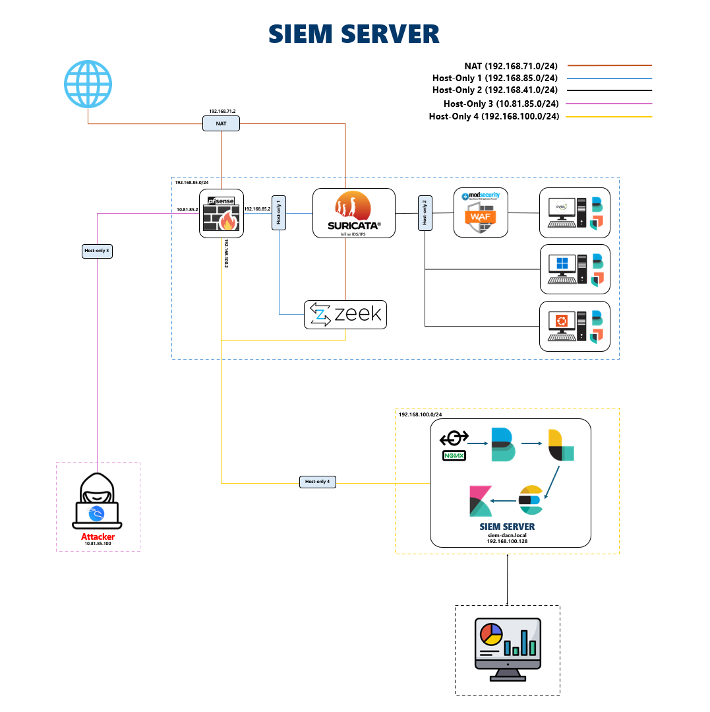
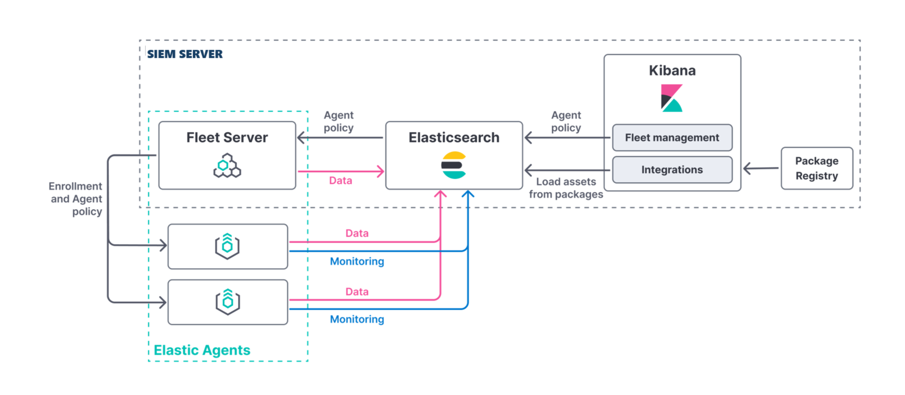

# Research and Implementation of a Centralized Management and Processing System for Cyber Attack Events


# 1. Project Overview

This project presents the design and implementation of a fully operational Security Information and Event Management (SIEM) platform leveraging the Elastic Stack. It centralizes the collection, processing, analysis, and visualization of security events generated by:

- Windows and Linux endpoints (event logs, syslogs)
- Network devices (pfSense firewall, Suricata IDS/IPS, Zeek)
- Web applications (Nginx access logs, ModSecurity WAF alerts)
- Elastic Agents for system and application metrics

Key objectives:

- Build a scalable, resilient Elastic Stack deployment (Elasticsearch, Logstash, Kibana, Fleet Server).
- Configure multi-source data ingestion and parsing pipelines.
- Implement network and host-based intrusion detection (Suricata, Zeek).
- Enforce web application protection with ModSecurity and OWASP CRS.
- Develop dashboards, alerts, and detection rules with Elastic Security (MITRE ATT&CK alignment).


# 2. System Architecture



## 2.1. Network Topology & Segmentation

|Name| CIDR             | Purpose                                |
|-----|------------------|----------------------------------------|
|NAT| 192.168.71.0/24  | NAT network (Internet egress)          |
|Host-Only 1| 192.168.85.0/24  | Segment: pfSense ↔ Suricata/Zeek            |
|Host-Only 2| 192.168.41.0/24  | Segment: Suricata ↔ WAF/Web Servers/Clients  |
|Host-Only 3|  10.81.85.0/24| Attacker network                   |
|Host-Only 4| 192.168.100.0/24 | SIEM Server LAN                        |

## 2.2. Data Flow & Components



1. **Fleet Server & Elastic Agents**
   - Elastic Agents enroll via Fleet Server and receive policies for log, metric, endpoint, and security data collection.
2. **Log Collection**
   - Filebeat modules and Elastic Agents forward logs from Windows Event Logs, syslog, Nginx, pfSense, and Suricata to Logstash.
   - Zeek captures network traffic and generates detailed session logs (conn, http, dns, ssl).
3. **Data Processing**
   - Logstash pipelines parse, normalize (ECS), enrich (geoip, user_agent), and route events to Elasticsearch indices.
4. **Storage & Analysis**
   - Elasticsearch cluster stores indexed data with ILM policies for retention and rollover.
   - Elastic Security app in Kibana enables detection rules, threat maps, and case management.
5. **Visualization & Alerting**
   - Kibana dashboards display security metrics (login trends, IDS alerts, WAF blocks).
   - Watchers and alerts notify via email/Slack on critical events.


## 2.3. Core Technologies

- **Elastic Stack & Fleet**: Elasticsearch, Logstash, Kibana, Fleet Server, Elastic Agent
- **Intrusion Detection & Analysis**:
  - Suricata (inline IDS/IPS)
  - Zeek (network traffic analysis)
- **Web Application Firewall**: ModSecurity with OWASP Core Rule Set
- **Reverse Proxy & Security**: Nginx for HTTPS termination and access control
- **Detection & Analytics**:
  - Elastic Security rules (built-in and custom, MITRE ATT&CK mapped)
  - Kibana Query Language (KQL) and Elasticsearch Query DSL
- **Simulation Environment**: Metasploitable2, attacker VM for generating test events

# 3. Implementation Details
## 3.1. System Architecture & Deployment

* Designed and implemented the overall architecture of the Elastic Stack–based SIEM system, including deploying core components (Elasticsearch, Logstash, Kibana) and data collection agents (Filebeat, Elastic Agent).
* Configured Nginx as a reverse proxy to manage access and provide security (HTTPS) for SIEM components (Filebeat/Logstash input, Kibana UI).
* Set up pfSense as the central router and firewall, configuring routing rules, NAT, and forwarding system logs.
* Deployed Suricata in Inline IDS/IPS mode to monitor and detect intrusion behaviors based on signature rules.
* Developed and refined custom Suricata rules to test the detection capabilities against specific attack types.

## 3.2. Data Ingestion & Management

* Built Logstash pipelines to receive, parse, standardize (using grok, mutate, json, prune filters), and clean data from diverse sources (Suricata eve.json, Nginx logs, system logs, Windows Security logs) before storing it in Elasticsearch.
* Managed data storage in Elasticsearch, including understanding Index, Document, Mapping, Sharding, and Replication for performance and availability.

## 3.3. Monitoring, Visualization & Detection

* Utilized Kibana to create Index Patterns, build Visualizations (charts, tables), and Dashboards to visualize and monitor security data in real time.
* Performed data querying in Kibana using Kibana Query Language (KQL) and Elasticsearch Query DSL for in-depth analysis.
* Developed and implemented Detection Rules within Kibana SIEM to automatically detect suspicious behaviors and attacks (e.g., ICMP/UDP Flood, SSH Brute Force, Command Injection), mapping these rules to the MITRE ATT\&CK Framework.

## 3.4. Testing, Analysis & Security Hardening

* Conducted basic attack simulations (ICMP Flood, UDP Flood, simple C2 over HTTPS/TLS) to test the detection capabilities of Suricata and the SIEM.
* Researched and gained understanding of the structure and important log types on Windows (.evtx) and Linux (/var/log/\*) operating systems to facilitate collection and analysis.
* Applied basic security principles within the Elastic Stack (authentication, RBAC authorization, SSL/TLS encryption) to protect data and the system.


# 4. Prerequisites
## 4.1. Hardware & Software
- **Hardware**: Ubuntu with ≥4 GB RAM, ≥4 vCPU
- **Software**:
  - Ubuntu 20.04+ (server and VMs)
  - Elasticsearch 8.x, Kibana 8.x, Logstash 8.x
  - Fleet Server and Elastic Agent 8.x
  - pfSense 2.5+, Suricata 6.x, Zeek 4.x
  - Nginx 1.18+, ModSecurity 3.x
- **Network**: Host-Only and NAT interfaces configured per topology above

## 4.2. Repository Structure

```
├── config/                  # Configuration files for Logstash, Filebeat, Suricata, ModSecurity, Nginx
├── demo/                    # Demo video
├── docs/                    # Detailed documentation and project reports
├── img/                     # Image for demo
├── install/                 # Install Guide
└── src/                     # Sources Code
```


# 5. Installation & Deployment

See [install/](install/) for more details.


# 6. Future Work

- Expand Zeek integration via Fleet and custom parsers.  
- Enable Elastic Machine Learning jobs for anomaly detection.  
- Implement automated playbooks for incident response.  
- Develop AI‑driven Threat Hunting pipelines using Elastic’s EQL and Python notebooks.  
- Integrate SOAR to automate triage, enrichment and response workflows.  
- Build User and Entity Behavior Analytics (UEBA) models to detect insider threats and compromised accounts.  
- Incorporate Threat Intelligence Platform (TIP) feeds (MISP, STIX/TAXII) into detection rules.  
- Prototype real‑time attack simulation and ML‑based predictive alerting (red‑team vs. blue‑team).  

# 7. References

1. Elastic Stack Documentation — https://www.elastic.co/guide
2. Suricata Official Docs — https://suricata-ids.org
3. Zeek Network Security Monitor — https://zeek.org
4. ModSecurity Handbook — https://www.modsecurity.org
5. pfSense Guide — https://docs.netgate.com/pfsense/en/latest/ 
6. RBAC in ELastic — https://www.elastic.co/guide/en/app-search/current/security-and-users.html 
7. Elastic Security — https://www.elastic.co/security
8. MITRE ATT&CK — https://attack.mitre.org


# 8. Collaborators
- **Lại Quan Thiên** - [WanThinnn](https://github.com/WanThinnn)
- **Hồ Diệp Huy** - [hohuyy](https://github.com/hohuyy)
